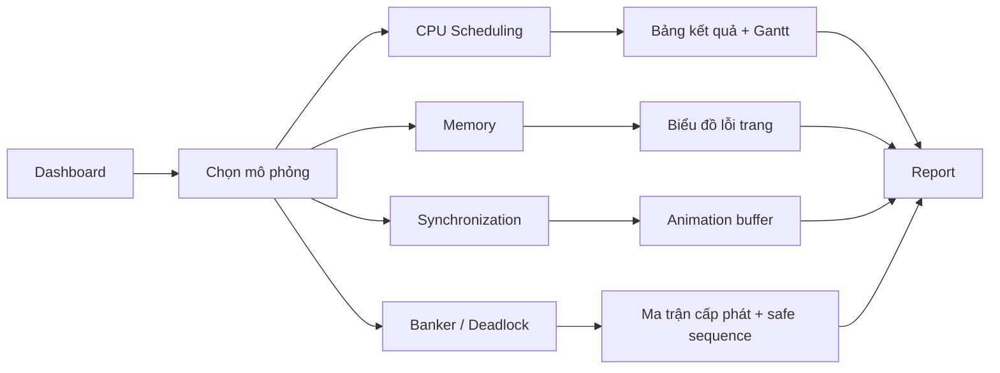

# BÁO CÁO ĐỒ ÁN HỆ ĐIỀU HÀNH

- Tên đề tài: Xây dựng ứng dụng mô phỏng các cơ chế: tiến trình, lập lịch CPU, bộ nhớ, đồng bộ hóa và đánh giá hiệu năng hệ thống
- Sinh viên: [Họ và tên]
- Lớp: [Lớp]
- Giảng viên hướng dẫn: [Tên GVHD]
- Công nghệ: Django Web App
- Ngày: [dd/mm/yyyy]

## 1. Giới thiệu lý thuyết

### 1.1 Mục tiêu đề tài
Đề tài xây dựng một ứng dụng mô phỏng các nội dung cốt lõi của Hệ điều hành trên nền web. Mỗi phiên chơi trong hệ thống quán net được xem như một tiến trình; máy tính, RAM, tai nghe và tài khoản game được xem như các tài nguyên. Từ mô hình này, ứng dụng cho phép mô phỏng và đánh giá nhiều cơ chế quan trọng của hệ điều hành theo cách trực quan, dễ hiểu và có thể chạy trực tiếp trên trình duyệt.

### 1.2 Các khái niệm OS được mô phỏng
- Tiến trình: trạng thái, thời điểm đến, thời gian phục vụ, hoàn thành.
- Lập lịch CPU: FCFS, SJF, Round Robin.
- Bộ nhớ: FIFO, LRU, OPT, hit/fault, page replacement.
- Đồng bộ hóa: bounded buffer, producer-consumer, semaphore, vùng găng.
- Cấp phát tài nguyên: Banker Algorithm, safety check, request resource, deadlock.
- Hiệu năng hệ thống: waiting time, turnaround time, response time, CPU utilization, hit rate, fault rate.

### 1.3 Ý nghĩa thực tiễn
Ứng dụng giúp chuyển các khái niệm lý thuyết của Hệ điều hành thành mô hình gần gũi với thực tế quán net. Người dùng có thể quan sát ngay cách các thuật toán hoạt động, so sánh kết quả, và rút ra nhận xét về sự công bằng, tốc độ phản hồi, khả năng tránh deadlock và hiệu quả khai thác tài nguyên.

### 1.4 Các thuật toán chính trong đề tài
- CPU scheduling: FCFS, SJF, Round Robin.
- Memory management: FIFO, LRU, OPT.
- Synchronization: Producer-Consumer, bounded buffer.
- Resource allocation: Banker, safety algorithm, request test.

## 2. Mô tả thiết kế hệ thống

### 2.1 Kiến trúc tổng thể
Ứng dụng được xây dựng theo mô hình Django Web App với các lớp chính:
- `models`: lưu dữ liệu máy, khách hàng, phiên chơi, hàng chờ, dịch vụ.
- `views`: xử lý logic dashboard, mô phỏng và báo cáo.
- `templates`: trình bày giao diện web.
- `static`: chứa CSS, JavaScript và tài nguyên hình ảnh.

### 2.2 Sơ đồ luồng xử lý


### 2.3 Thiết kế dữ liệu
- Mỗi `Session` có thể ánh xạ thành một tiến trình mô phỏng.
- `Queue` đại diện cho hàng chờ khi chưa có máy phù hợp.
- `Machine` là tài nguyên hệ thống.
- `Service` và `SessionService` mô phỏng các dịch vụ đi kèm.
- `Banker` sử dụng vector tài nguyên, ma trận cấp phát và ma trận nhu cầu tối đa.

### 2.4 Thiết kế giao diện
- Dashboard là trang trung tâm.
- Trang mô phỏng tổng quan dùng biểu đồ, bảng dữ liệu và nút điều hướng.
- CPU scheduling có Gantt chart và animation từng bước.
- Memory simulation có bảng so sánh page fault / hit rate.
- Synchronization mô phỏng tiến trình sản xuất và tiêu thụ theo thời gian.
- Banker mô phỏng an toàn cấp phát tài nguyên.

### 2.5 Công nghệ sử dụng
- Backend: Python, Django.
- Frontend: Bootstrap, HTML, CSS, JavaScript.
- Biểu đồ: Chart.js.
- Hiệu ứng trực quan: CSS animation, carousel, Gantt chart, progress bar.

## 3. Giao diện trực quan

### 3.1 Dashboard tổng quan
Trang dashboard hiển thị:
- Số máy sẵn sàng
- Số phiên đang chạy
- Doanh thu hôm nay
- Số khách đang chờ
- Sơ đồ phòng máy dạng thẻ trực quan
- Danh sách phiên mới nhất và hàng chờ

### 3.2 Màn hình mô phỏng CPU Scheduling
- Chọn giải thuật: FCFS, SJF, Round Robin
- Nhập quantum cho Round Robin
- Chọn nguồn dữ liệu: thực tế, nhập tay, sinh ngẫu nhiên
- Hiển thị Gantt chart tương tác
- Hiển thị waiting queue, current process, timeline, thống kê hiệu năng

### 3.3 Màn hình mô phỏng bộ nhớ
- So sánh FIFO, LRU, OPT
- Hiển thị chuỗi tham chiếu trang
- Thể hiện page fault / hit bằng bảng và biểu đồ
- Cho phép chạy với dữ liệu thực, nhập tay hoặc ngẫu nhiên

### 3.4 Màn hình mô phỏng đồng bộ hóa
- Minh họa producer-consumer
- Thể hiện trạng thái buffer theo từng bước
- Quan sát tình trạng chờ, sản xuất và tiêu thụ

### 3.5 Màn hình mô phỏng Banker
- Kiểm tra trạng thái an toàn
- Hiển thị allocation, max need, available, need
- Trình bày safe sequence
- Mô phỏng request mới và kiểm tra có cấp phát được hay không

### 3.6 Bảng minh họa theo yêu cầu rubric
| Hạng mục | Giao diện trong app | Kết quả trực quan |
|---|---|---|
| Tiến trình | Dashboard, check-in, queue | Danh sách phiên, hàng chờ, trạng thái máy |
| CPU scheduling | scheduling_sim | Gantt chart, animation từng bước, thống kê |
| Bộ nhớ | memory_sim | Bảng frame, page fault / hit rate |
| Đồng bộ hóa | synchronization_sim | Buffer animation, bước producer/consumer |
| Banker | banker_sim | Ma trận an toàn, safe sequence, request test |
| Hiệu năng | report | So sánh nhiều thuật toán và tổng hợp chỉ số |

## 4. So sánh nhiều thuật toán

### 4.1 So sánh CPU scheduling
Ứng dụng so sánh ba thuật toán:
- FCFS: đơn giản, dễ hiểu, công bằng theo thứ tự đến nhưng có thể gây chờ dài.
- SJF: tối ưu thời gian chờ trung bình nhưng có nguy cơ starvation.
- Round Robin: công bằng, phản hồi tốt, phù hợp hệ thống tương tác.

Các chỉ số đánh giá:
- Average Waiting Time
- Average Response Time
- Average Turnaround Time
- CPU Utilization

### 4.2 So sánh bộ nhớ
Ứng dụng so sánh:
- FIFO
- LRU
- OPT

Các chỉ số:
- Số lỗi trang
- Hit rate
- Fault rate

### 4.3 So sánh trong mô phỏng Banker
- So sánh trạng thái an toàn và không an toàn.
- So sánh request được cấp và request bị từ chối.
- Trình bày điều kiện tài nguyên trước và sau khi cấp phát.

### 4.4 Nhận xét tổng hợp
- FCFS phù hợp cho minh họa đơn giản.
- SJF cho kết quả tốt khi ưu tiên tiến trình ngắn.
- Round Robin cân bằng hơn trong môi trường tương tác.
- LRU và OPT thường giảm lỗi trang tốt hơn FIFO.
- Banker giúp tránh cấp phát nguy hiểm và giảm nguy cơ deadlock.

## 5. Kết luận
Ứng dụng đã đáp ứng đúng tinh thần đề tài: mô phỏng cơ chế tiến trình, lập lịch CPU, bộ nhớ, đồng bộ hóa và đánh giá hiệu năng hệ thống trên nền web. Giao diện trực quan, có biểu đồ và animation, đồng thời cho phép so sánh nhiều thuật toán để người học quan sát kết quả một cách trực tiếp.

## 6. Hướng dẫn chạy nhanh
```bash
python manage.py migrate
python manage.py runserver
```

## 7. Gợi ý hình ảnh chèn vào báo cáo
- Ảnh dashboard tổng quan
- Ảnh Gantt chart CPU scheduling
- Ảnh so sánh FIFO/LRU/OPT
- Ảnh mô phỏng producer-consumer
- Ảnh bảng Banker và safe sequence

